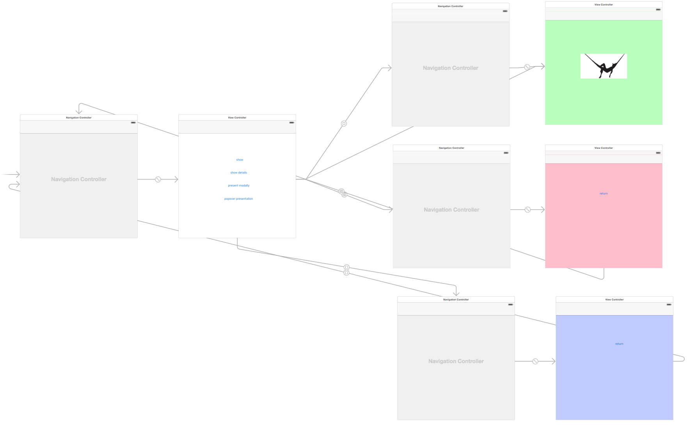
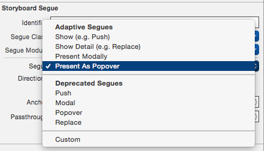

# ClaseUIViewController
Una pequeña clase de como interactuar con UIViewController en cocoa:

```Objective-C
        UIStoryboard *story = [UIStoryboard storyboardWithName:@"<#StoryBoardName#>"
                                                        bundle:[NSBundle mainBundle]];
        <#MyViewController#> *detail = [story instantiateViewControllerWithIdentifier:@"<#StoryBoardID#>"];
```


# Trabajando con StoryBoard
Con la llegada de Storyboard, el intercambio entre las disferentes vista en el desarrollo iOS hubo cambios significativos:

StoryBoard nos permite tener una vision general de las diferentes vistas de nuestra aplicación:




Además gracias a storyboard podemos instanciar diferentes cambios de vistas



En el proyecto **ClaseUIViewController** vamos a ver como realizar los diferentes cambios de vista y como gestionar estos tocado 0 lineas de código.

